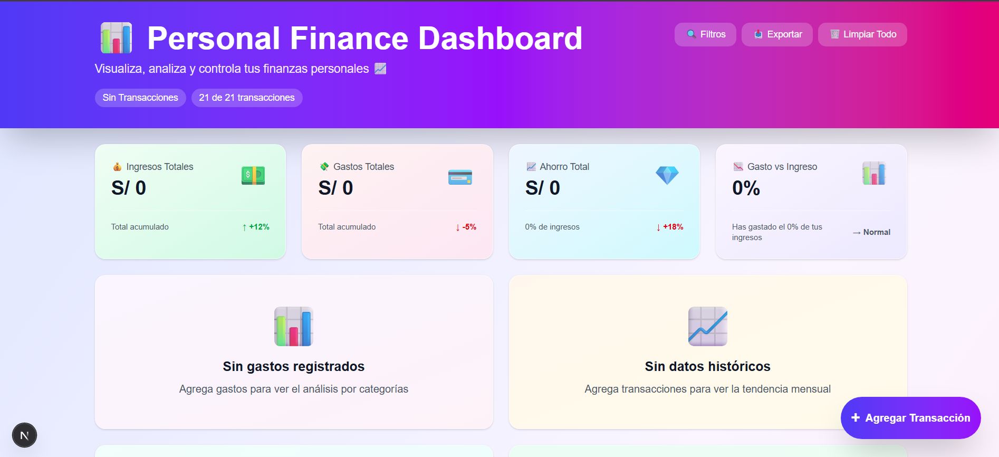
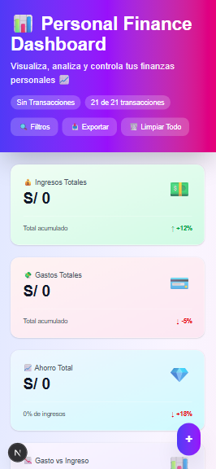

# 📊 Personal Finance Dashboard – Frontend Portfolio Project

A full-featured personal finance analytics dashboard built with Next.js, React, TypeScript, Tailwind CSS, and Recharts.

This project is part of my frontend developer portfolio and focuses on real-world UI architecture**, data-driven components**, and production-ready patterns commonly used in modern React applications.

---

## ✨ Live Demo

🚧 Deployment in progress




---

## 🚀 Features

### 📈 Data Visualization

- Expense breakdown by category (Pie Chart)
- Monthly trends for income, expenses, and savings (Line Chart)
- Income vs expenses comparison (Bar Chart)
- KPI metric cards with trend indicators

### 💰 Transaction Management

- Create, edit, and delete transactions
- Transaction type classification (income / expense)
- **9 expense categories** and **5 income categories**
- Custom transaction date selection
- Chronologically ordered transaction history

### 🔄 Recurring Expenses

- Monthly subscriptions management
- Inline amount editing
- Emoji-based category icons
- Automatic monthly total calculation

### 🔍 Advanced Filtering System

- Filter by type (all / income / expenses)
- Filter by category
- Filter by time range (month / quarter / year)
- Real-time search by description
- Visual indicators for active filters

### 📊 Smart Financial Insights

- Automatic financial metrics calculation
- Savings goal visualization (**20% recommended rule**)
- Deficit month detection
- Alerts and recommendations panel
- Average savings statistics

### 💾 Data Persistence

- Client-side persistence using **localStorage**
- Automatic data loading on app start
- Export data to JSON
- Full data reset option

### 🎨 Design & UX

- Modern UI with vibrant gradients
- Smooth animations and micro-interactions
- Fully responsive (mobile-first)
- Light theme with color accents per section
- Emoji icons for better visual clarity

---

## 🧠 Project Structure

```
src/
├── app/
│   ├── globals.css          # Global styles & theme
│   ├── layout.tsx          # Root layout & metadata
│   └── page.tsx            # Main page
│
├── components/
│   ├── Dashboard.tsx         # Global state & core logic
│   ├── MetricCard.tsx        # KPI cards with trends
│   ├── CategoryChart.tsx     # Pie chart (Recharts)
│   ├── MonthlyTrend.tsx      # Line chart (Recharts)
│   ├── IncomeVsExpenses.tsx  # Bar chart (Recharts)
│   ├── SavingsGoal.tsx       # Savings goal visualization
│   ├── RecurringExpenses.tsx # Recurring expenses manager
│   ├── AlertsPanel.tsx       # Alerts & recommendations
│   ├── TransactionForm.tsx   # Transaction creation modal
│   └── TransactionList.tsx   # Editable transaction list
│
└── data/
    └── mockData.ts           # Initial mock data & TS types
```

---

## ⚙️ Tech Stack

- Next.js 16
- React 19
- TypeScript
- Tailwind CSS v4
- Recharts
- localStorage API

---

## 🧩 Key Implementation Details

- The application relies on `useState` and `useEffect` to handle transactions, recurring expenses, filters, and derived financial metrics in a predictable and maintainable way.

- Multiple filters (transaction type, category, date range, and search query) are composed together to produce accurate, real-time views of the data without unnecessary re-renders.

- Financial data is stored in `localStorage`, allowing users to retain their information across sessions without requiring a backend.

- Components gracefully handle empty or zero-value datasets, displaying meaningful fallback messages instead of broken charts or blank screens.

- Charts and metric cards react automatically to state changes, ensuring that insights are always consistent with the underlying data.

- Each feature is isolated into reusable, focused components, making the codebase easy to extend and maintain as new features are added.

---

## 🛠 Installation & Usage

```bash
# Install dependencies
npm install

# Run in development mode
npm run dev

# Build for production
npm run build

# Start production server
npm start
```

---

## 📱 Responsive Behavior

- Desktop: 4-column KPI layout
- Tablet: Adaptive 2-column layout
- Mobile: Single-column layout with optimized navigation
- Charts: Auto-resize with `ResponsiveContainer`
- Modals: Fullscreen experience on mobile

---

## 🎯 Project Purpose

This project was built to:

- ✅ Demonstrate strong React + TypeScript + Next.js skills
- ✅ Showcase data visualization using specialized libraries
- ✅ Implement scalable and maintainable component architecture
- ✅ Build a real-world app with polished UX
- ✅ Manage complex state from multiple data sources
- ✅ Implement client-side data persistence
- ✅ Serve as a flagship project in my frontend portfolio

---

## 🔮 Future Improvements

- Dark mode
- Additional chart types (donut, area, radar)
- Category-based budgets
- Custom savings goals
- Year-over-year comparison
- Export to Excel / PDF

---

## 👤 Author

Andy Sebastian
Frontend Developer

- GitHub: [https://github.com/andydevsoftware]
- Portfolio: In progress
